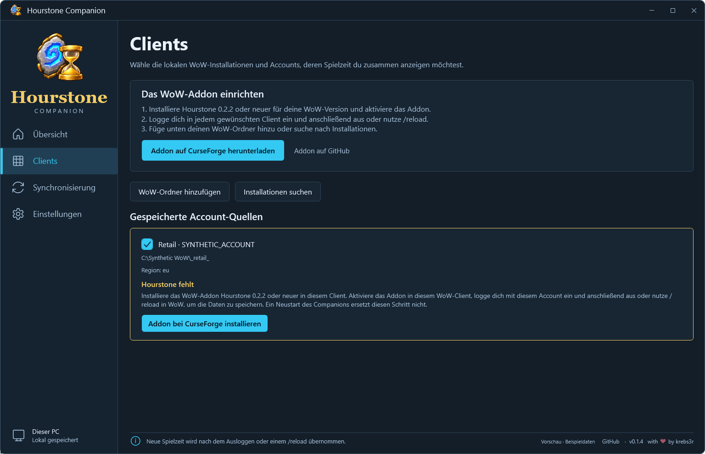
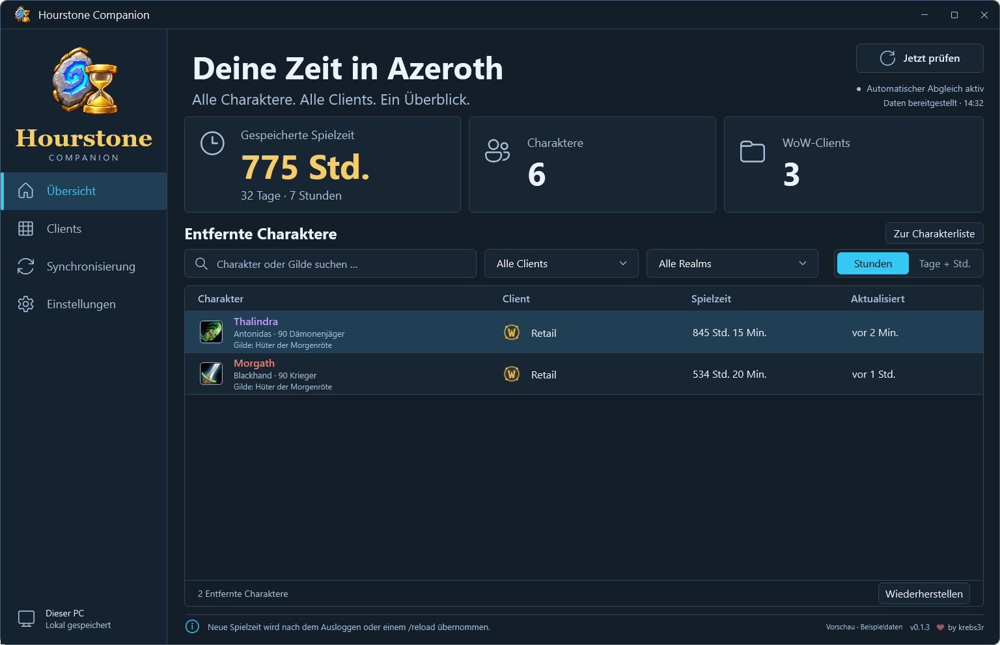
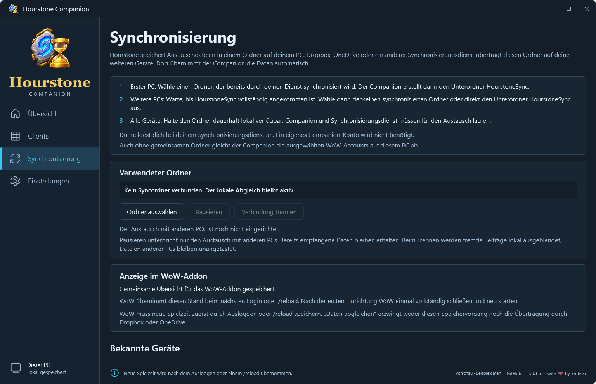

# Hourstone Companion

A Windows companion for [Hourstone – Azeroth Hours](https://github.com/krebs3r/hourstone-azeroth-hours).
View saved character playtime across supported WoW clients and Retail progress,
and synchronize your own PCs through a locally available Dropbox, OneDrive or
Proton Drive folder.

[Download Hourstone Companion for Windows](https://github.com/krebs3r/hourstone-companion/releases/latest)

Choose the **Setup.exe** installer or fully extract the **Portable.zip** package.
The .NET runtime is included. **Version 0.2.0** adds Retail progress and includes
the earlier 0.1.7 fixes. GitHub packages are **unsigned**; Windows may warn about
an unknown publisher or block the installer. The portable launcher passed an
isolated startup check. End-to-end Dropbox, OneDrive and Proton Drive exchange
between two PCs still needs practical validation. See the
[release notes](docs/RELEASE-NOTES.md) for compatibility and validation limits.

The separate Microsoft Store package **1.0.1.0** (product version 0.2.0) was
resubmitted on 25 September 2026 and is awaiting certification. This GitHub
release does not imply Store approval. See the [Store status](docs/STORE.md).


## What it does

- Character overview with guilds, total playtime, character/guild search, client and realm filters.
- Retail progress with owned keystone, weekly best and all nine Great Vault slots,
  with separate unknown, confirmed-empty and outdated states.
- Reversible deletion from the overview, synchronized across your own PCs.
- Local, read-only ingestion of selected Hourstone account data.
- Optional device synchronization using one snapshot per computer and no companion server.
- A generated data addon makes the combined overview available in WoW.
- Windows tray operation, configurable autostart, German/English and dark/light/system themes.
- Clear save feedback, per-account setup guidance and original class and game icons.

It supports **Windows 11 x64** with Retail, Mists Classic, TBC Anniversary and Classic
Era. The WoW addon also works independently. Compatibility depends on the feature:

| Feature | Required addon | Required Companion |
| --- | --- | --- |
| Playtime, guilds and character visibility | Hourstone 0.2.2 or later | 0.2.0 reads existing data |
| Read locally saved Retail progress and exchange it between Companions | Hourstone 0.3.1 or later | 0.2.0 on every participating PC |
| Send combined Retail progress back into WoW | Hourstone 0.3.2 with its protocol-4 capability | 0.2.0 |

New shared-folder snapshots use protocol 4. Upgrade **all participating Companions
to 0.2.0 together** before using that exchange; older Companions cannot read the
new snapshots. The new Companion continues reading older snapshots and sends a
compatible protocol-3 payload containing playtime, guilds and visibility to addons
without protocol-4 support.
There is no sync-group reset.

## Setup

1. Use **Download addon on CurseForge** on the **Clients** page, or open
   [Hourstone on CurseForge](https://www.curseforge.com/wow/addons/hourstone-azeroth-hours).
   Use an addon version matching the compatibility table above. Addon
   [0.3.3 is also available on GitHub](https://github.com/krebs3r/hourstone-azeroth-hours/releases/tag/v0.3.3)
   and supports the complete progress exchange.
   Enable Hourstone, log in with each account and log out or run `/reload` once so the addon saves its source identifier.
2. Choose **Find installations** and select your WoW installations and account sources.
3. Restart WoW once after the companion first creates the `Hourstone_Sync` addon.
   Later updates become available on login or reload.
4. For multiple computers, follow **Synchronization** below to connect a locally
   available Dropbox, OneDrive, Proton Drive or other synchronized folder.

The download button opens the official CurseForge page in your default browser;
installation is handled there. It is available before you configure any sources,
and missing or outdated addons show the same action beside their setup instructions.
**Addon on GitHub** links to the addon source; **GitHub** in the footer opens this
companion repository. The footer also shows the version and **with ♥ by krebs3r**.



Check the version of the addon package you install. Hourstone 0.1.x cannot provide
Companion synchronization. The addon download action opens its official page; it
does not install the addon or confirm which version a service currently distributes.

Guilds appear beneath each character. **No guild** is a confirmed state;
**Not yet recorded** means that character still needs a login with Hourstone 0.2.1
or later, followed by logout or `/reload`. The last saved guild is shown while
the character is offline. Guild changes synchronize independently of playtime.
Earlier snapshots and existing settings and databases remain readable. Version
0.2.0 upgrades the local database to store progress separately from playtime.
Older Companions cannot open that profile after migration. Upgrade every PC in
the synchronization group together before continuing shared-folder exchange.

On **Progress**, select a Retail character to see its saved keystone, weekly best
and the Dungeon, Raid and World reward rows. Search and realm filters are separate
from the playtime view. Each area retains its own capture time and weekly reset;
an unknown value differs from a confirmed absence or an expired observation.
Progress comes from the addon's actual observations, including localized dungeon
and difficulty names. A login followed by logout or `/reload` saves new data.
Receiving another PC's progress never turns it into a new local observation.

Use the trash icon to the right of a character's last update to exclude it from
the list and its total, after confirmation. No row selection is required. The WoW
character and saved playtime are kept. **Deleted characters** opens the list with
a **Restore character** icon in the same position on each row.



A fresh WoW login also restores the character, once the removal has reached that
addon. A `/reload`, app restart or old file from an offline laptop does not restore
it. Removing the character you are currently playing keeps it hidden until the
next login; time measurement continues. Both apps exchange these decisions
alongside saved measurements. Characters deleted inside WoW remain in Hourstone
until you delete their entries from the overview; renaming a character with the same GUID preserves
its entry and time.

In **Settings**, changing the device name, appearance, language or autostart enables
**Save changes**. The highlighted button applies the choices; the unsaved status
clears after a successful save. Closing to the tray keeps the current draft.


If an account is waiting for its first save, log in **inside that WoW client** with
Hourstone 0.2.2 or later, then log out or run `/reload`. Restarting the Companion alone is
not enough. The Clients page identifies each account that still needs this step.

WoW must save, the provider must transport the files, and the target client must
load the data. The companion reports these stages separately. It does not claim
that a cloud upload has finished or another computer is online.

The companion never overwrites WoW SavedVariables and never executes their Lua
contents. It keeps its SQLite database, settings and device identity locally.
Only selected character observations, their Retail progress and the matching removal/restoration controls
enter the provider folder. Learned controls stay locally after disconnecting;
unrelated old-group identities are not published into a new group.

## Synchronization



Hourstone writes exchange files to a local folder. Dropbox, OneDrive, Proton Drive or another
file synchronization service transfers that folder to your other computers; their
Companion apps then import the files automatically. Sign in to your chosen service,
not to Hourstone. No Companion account or hosted Hourstone server is needed.

1. On the first PC, choose a folder already synchronized by your service.
   Hourstone creates an **HourstoneSync** subfolder there.
2. On another PC, wait until that subfolder and its contents have arrived, then
   select the same synchronized folder or **HourstoneSync** itself. This joins
   the existing group instead of creating a separate one in an empty folder.
3. Keep **HourstoneSync** available offline on every PC, and keep both Companion
   and the synchronization service running for exchange. Use Dropbox's offline
   availability option or OneDrive's or Proton Drive's **Always keep on this device**
   option (German: **Immer auf diesem Gerät behalten**). Apply this to the whole
   folder on both PCs and wait for the download to finish. Seeing a file in
   Explorer does not mean its contents are already available locally.

For Proton Drive, see its [Windows on-demand sync guide](https://proton.me/support/proton-drive-windows-on-demand-sync).
On **Synchronization → Local diagnostics**, the app shows local source and folder
exchange details, including when no shared folder is configured.
If the Companion reports `cloud_file_not_local`, its diagnostics identify the
affected file and explain this offline setting. Once the file is locally available,
choose **Sync data** or let the next automatic check retry. Last valid data is kept;
you do not need to disconnect the folder or reset the sync group. Older Companion
versions may report this same availability problem as `snapshot_rejected` with
**Could not read a stable file** instead.

**Sync data** reads the last saved Hourstone files of all selected accounts,
imports available data from other PCs, updates the overview and writes the combined
data for the WoW addon. The same cycle runs at startup, after file changes and every
30 seconds. The button does not make WoW save and does not force a cloud transfer.
Save new playtime by logging out or using `/reload` in WoW first.

**Last sync check** is the time of the completed check, not the last playtime change.
Files in the sync folder do not confirm that another PC has received them.
WoW loads the prepared overview at its next login or `/reload`; after the first
creation of **Hourstone_Sync**, restart WoW completely once. The reload that caused
WoW to save may finish before the Companion has prepared the new overview.

Without a shared folder, local processing still works. **Pause** stops folder
exchange while keeping local processing and received data. The current folder
path and separate folder/WoW status messages are shown on **Synchronization**.

## Application updates

The direct Windows edition checks the public stable releases of this repository at startup and
every 24 hours while running. No GitHub login is required; prereleases are excluded.
**Check for app updates** performs the same check immediately and downloads an
available update. Releases must contain the Velopack feed and update packages;
a source commit, tag or standalone installer is not an update feed.

After download, the app announces the update. It waits until WoW is closed, the
window is inactive, at least 90 seconds have passed without input and at least
30 seconds have passed since the notice. Open dialogs, synchronization, saving and
unsaved settings prevent installation. The app restarts in the background, retaining
its settings and data. Update errors leave local processing available.

Installed copies and fully extracted Velopack portable packages support updates.
Unpackaged development builds do not. **The WoW addon is updated separately through
CurseForge.**

The direct installer/portable edition remains independent of Microsoft Store.
The additional Store edition is prepared as MSIX and uses Store
updates instead of the GitHub updater. Its first launch offers a controlled
transfer from an existing direct installation before synchronization starts;
the two editions keep separate application profiles. No Store listing or approval
is implied by a local test package. See [Microsoft Store preparation](docs/STORE.md)
for package identities, transfer behavior and remaining installed-package checks.
The first Store submission failed certification on 21 September 2026 under
10.6.3 (Capabilities). Package 1.0.1.0 removes the restricted
`unvirtualizedResources` capability and replaces automatic legacy-startup removal
with a guided manual switch. Store startup still uses Windows' StartupTask.
Support: **mail@martin-krebs.eu** and [GitHub issues](https://github.com/krebs3r/hourstone-companion/issues).
The [remediation record](docs/store/CERTIFICATION-FIX-2026-09-24.md) distinguishes
completed checks from remaining installed-package testing. Version 1.0.1.0 was
resubmitted on 25 September 2026 at 19:36 UTC. Partner Center confirmed
In certification, with pre-processing in progress; approval and publication are pending.

## Build and test

Install the [.NET 10 SDK](https://dotnet.microsoft.com/en-us/download/dotnet/10.0)
for Windows x64. The repository pins its SDK and dependency versions.

```powershell
dotnet restore Hourstone.Companion.slnx --locked-mode
dotnet build Hourstone.Companion.slnx -c Release --no-restore
dotnet test Hourstone.Companion.slnx -c Release --no-build
dotnet run --project src/Hourstone.Companion.App -- --demo
pwsh -File tools/render-smoke.ps1
pwsh -File tools/package.ps1 -Unsigned
```

Local package builds are unsigned by default in the example above. Public unsigned
releases require an explicit publishing option; signed releases remain the default.
End-user builds include the .NET runtime; users do not need an SDK. See [Development](docs/DEVELOPMENT.md),
[Release validation](docs/RELEASING.md) and the
[pinned synchronization contract](docs/sync-protocol-v4.md).

## Project boundaries

This version does not provide daily/weekly playtime statistics, global deletion,
direct provider APIs, a hosted account service, or macOS/Linux builds. Disconnecting
a sync folder removes received contributions locally and does not delete files on
other computers.

Source code is [MIT licensed](LICENSE). Original Blizzard images have separate
[asset notices and provenance](docs/ASSETS.md). Dependency and asset notices are included in packages.
Hourstone is an independent project and is not affiliated with Blizzard Entertainment.
