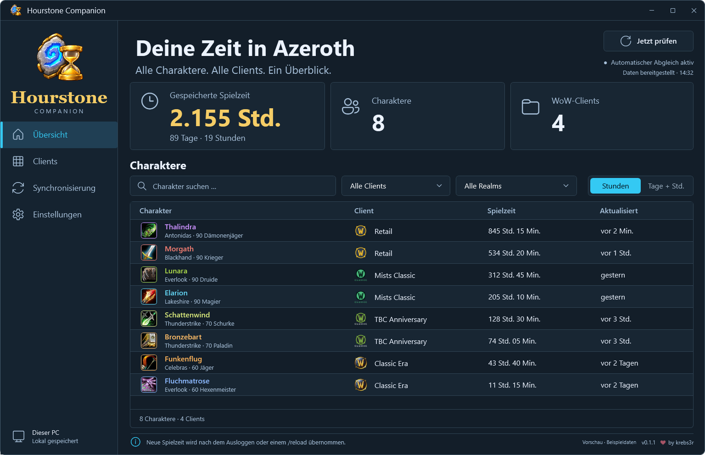
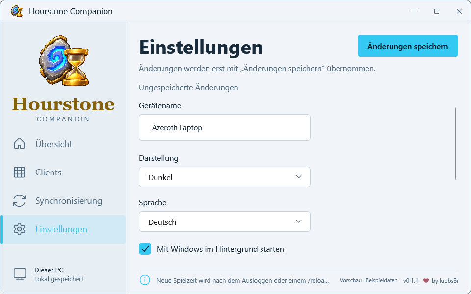

# Hourstone Companion

A Windows companion for [Hourstone – Azeroth Hours](https://github.com/krebs3r/hourstone-azeroth-hours).
View saved character playtime across supported WoW clients and synchronize your
own PCs through a locally available Dropbox or OneDrive folder.

**Development preview.** The source builds locally. A public installer is released
only after signing and the checks in [Release validation](docs/RELEASING.md).
Live WoW clients and two-device provider synchronization require practical validation.



## What it does

- Character overview with total playtime, search, client and realm filters.
- Local, read-only ingestion of selected Hourstone account data.
- Optional device synchronization using one snapshot per computer and no companion server.
- A generated data addon makes the combined overview available in WoW.
- Windows tray operation, configurable autostart, German/English and dark/light/system themes.
- Clear save feedback, per-account setup guidance and original class and game icons.

It supports **Windows 11 x64** and Hourstone **0.2.0** with Retail, Mists Classic,
TBC Anniversary and Classic Era. The WoW addon also works independently.

## Setup

1. Install or update [Hourstone](https://github.com/krebs3r/hourstone-azeroth-hours).
   Log in with each account and log out or reload once so the addon saves its source identifier.
2. Start the companion and select your WoW installations and account sources.
3. Restart WoW once after the companion first creates the `Hourstone_Sync` addon.
   Later updates become available on login or reload.
4. For multiple computers, select the same provider folder on each computer and
   keep it available offline in Dropbox or OneDrive.

In **Settings**, changing the device name, appearance, language or autostart enables
**Save changes**. The highlighted button applies the choices; the unsaved status
clears after a successful save. Closing to the tray keeps the current draft.



If an account is waiting for its first save, log in **inside that WoW client** with
Hourstone 0.2.0, then log out or run `/reload`. Restarting the Companion alone is
not enough. The Clients page identifies each account that still needs this step.

WoW must save, the provider must transport the files, and the target client must
load the data. The companion reports these stages separately. It does not claim
that a cloud upload has finished or another computer is online.

The companion never overwrites WoW SavedVariables and never executes their Lua
contents. It keeps its SQLite database, settings and device identity locally.
Only selected character observations enter the provider folder.

## Build and test

Install the [.NET 10 SDK](https://dotnet.microsoft.com/en-us/download/dotnet/10.0)
for Windows x64. The repository pins its SDK and dependency versions.

```powershell
dotnet restore Hourstone.Companion.slnx --locked-mode
dotnet build Hourstone.Companion.slnx -c Release --no-restore
dotnet test Hourstone.Companion.slnx -c Release --no-build
dotnet run --project src/Hourstone.Companion.App -- --demo
pwsh -File tools/render-smoke.ps1
pwsh -File tools/package.ps1 -Unsigned
```

Unsigned packages are for local testing. End-user builds include the .NET runtime;
users do not need an SDK. See [Development](docs/DEVELOPMENT.md),
[Release validation](docs/RELEASING.md) and the
[pinned synchronization contract](docs/sync-protocol-v1.md).

## Project boundaries

This first version does not provide daily/weekly statistics, global deletion,
direct provider APIs, a hosted account service, or macOS/Linux builds. Disconnecting
a sync folder removes received contributions locally and does not delete files on
other computers.

Source code is [MIT licensed](LICENSE). Original Blizzard images have separate
[asset notices and provenance](docs/ASSETS.md). Dependency and asset notices are included in packages.
Hourstone is an independent project and is not affiliated with Blizzard Entertainment.
